# aws-web-infra-monitoring

## Documentação: Implantação e Monitoramento Automatizado de Servidor Web Nginx

Este projeto automatiza a implantação, configuração e o monitoramento contínuo de um servidor web Nginx. É composto por um script de instalação (`instalador_nginx.sh`), um script de monitoramento (`service_status_check.sh`) e um `USERDATA` para provisionamento automático em instâncias AWS EC2.

-----

### 1. Script de Instalação: `instalador_nginx.sh`

**Objetivo:** Automatizar a instalação, configuração e monitoramento de um servidor Nginx em distribuições Linux baseadas em Debian (Ubuntu) e Red Hat (CentOS, Fedora, Amazon Linux).

#### Principais Funcionalidades

  * **Instalação Inteligente:** Detecta o sistema operacional e utiliza o gerenciador de pacotes apropriado (`apt`, `dnf`, `yum`).
  * **Modo Flexível:** Pode ser executado em modo **interativo** (pede confirmação) ou **não-interativo** (`-y`), ideal para automação.
  * **Configuração Automática:**
      * Configura o firewall (`ufw` ou `firewalld`) para liberar as portas 80 (HTTP) e 22 (SSH).
      * Cria uma página de teste (`index.html`) personalizada.
      * Configura o Nginx para reiniciar automaticamente (`Restart=on-failure`) 5 segundos após uma falha via `systemd`.
  * **Monitoramento Integrado (Opcional):** Instala e configura automaticamente o script `service_status_check.sh` como um serviço (`systemd`) para monitoramento contínuo.

#### Uso e Opções

Execute com `sudo`.

```bash
sudo ./instalador_nginx.sh [OPÇÕES]
```

| Opção Curta | Opção Longa | Argumento | Descrição |
| :--- | :--- | :--- | :--- |
| `-y` | `--yes` | - | Ativa o modo não-interativo e força a instalação do monitor. |
| | `--install-monitor` | - | Força a instalação do monitor, mesmo sem `-y`. |
| | `--discord-webhook` | `"URL"` | Define a URL do webhook do Discord para notificações. |
| | `--slack-webhook` | `"URL"` | Define a URL do webhook do Slack. |
| | `--telegram-token` | `"TOKEN"` | Define o token do bot do Telegram. |
| | `--telegram-chat-id`| `"ID"` | Define o Chat ID do Telegram. |
| `-h` | `--help` | - | Mostra a mensagem de ajuda. |

**Exemplo (automático com notificação no Discord):**

```bash
sudo ./instalador_nginx.sh -y --discord-webhook "URL_DO_SEU_WEBHOOK"
```

-----

### 2. Script de Monitoramento: `service_status_check.sh`

**Objetivo:** Realizar uma verificação de saúde completa de um serviço web, validando o processo, a porta de rede e a resposta HTTP.

#### Principais Funcionalidades

  * **Verificação em Três Níveis:**
    1.  **Serviço:** Confirma se o serviço está `active` no `systemd`.
    2.  **Porta:** Valida se a porta TCP especificada está em modo de escuta (`LISTEN`).
    3.  **HTTP:** Garante que o serviço responde com um código de status funcional (`2xx` ou `3xx`).
  * **Modo Contínuo:** Executa verificações em loop (`-c`) com intervalo configurável (`-i`).
  * **Notificações Inteligentes:** Envia alertas de **falha** e **recuperação** para Discord, Slack e Telegram.
  * **Logging Detalhado:** Registra todas as operações em um arquivo de log (padrão: `/var/log/<serviço>_check.log`) e exibe saídas coloridas no terminal.

#### Configuração de Notificações

As credenciais são carregadas do arquivo `/etc/service_monitor/config.env` ou via variáveis de ambiente.

  * **Discord:** `DISCORD_WEBHOOK_URL="SUA_URL"`
  * **Slack:** `SLACK_WEBHOOK_URL="SUA_URL"`
  * **Telegram:** `TELEGRAM_BOT_TOKEN="SEU_TOKEN"` e `TELEGRAM_CHAT_ID="SEU_ID"`

#### Uso e Opções

Execute com `sudo`.

```bash
sudo ./service_status_check.sh [OPÇÕES]
```

| Opção Curta | Opção Longa | Argumento | Descrição | Padrão |
| :--- | :--- | :--- | :--- | :--- |
| `-s` | `--service` | `<nome>` | Define o nome do serviço a ser verificado no `systemd`. | `nginx` |
| `-h` | `--host` | `<host>` | Define o host ou endereço IP para o teste HTTP. | `localhost` |
| `-p` | `--port` | `<porta>` | Define a porta TCP para os testes de rede e HTTP. | `80` |
| `-l` | `--log-file`| `<path>` | Caminho completo para o arquivo de log. | `/var/log/<serviço>_check.log` |
| `-c` | `--continuous`| - | Ativa o modo de verificação contínua. | Desativado |
| `-i` | `--interval` | `<segs>` | Intervalo em segundos entre as verificações no modo contínuo. | `60` |
| | `--help` | - | Mostra a mensagem de ajuda e sai. | - |

**Exemplo (monitorar o Apache na porta 8080 a cada 5 minutos):**

```bash
sudo ./service_status_check.sh -s apache2 -p 8080 -c -i 300
```

-----

### 3\. Automação em Nuvem: `USERDATA` para AWS EC2

**Objetivo:** Script de bootstrap para automatizar a execução do `instalador_nginx.sh` na inicialização de uma nova instância EC2.

#### Funcionamento

1.  Instala o `git`.
2.  Clona o repositório do projeto.
3.  Torna o `instalador_nginx.sh` executável.
4.  Executa o instalador em modo não-interativo (`-y`).

#### Uso e Personalização

Cole o conteúdo do script no campo **"User Data"** ao criar uma instância EC2. Para configurar as notificações desde o início, adicione os argumentos de webhook à última linha.


## Detalhamento por Etapas

### Etapa 1: Configuração do Ambiente

#### Criação da VPC

**Passos realizados:**

1.  **Criação da VPC na AWS com os seguintes componentes:**

      * **2 sub-redes públicas:** para acesso externo.
      * **2 sub-redes privadas:** para futuras expansões.
      * **Internet Gateway:** conectado às sub-redes públicas para permitir o acesso à internet.

    **VPC criada:**
        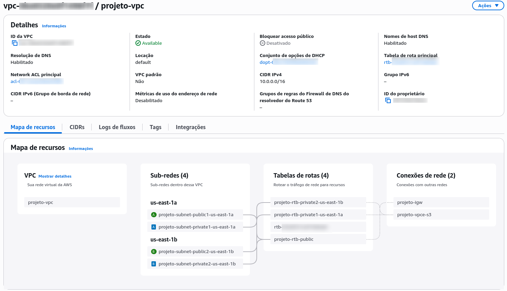


2.  **Criação da Instância EC2:**

      * **Generalidade:** O script de provisionamento foi desenvolvido para ser genérico, compatível com sistemas baseados em Debian/Ubuntu e Fedora/Amazon Linux.
      * A instância EC2 foi alocada em uma das sub-redes públicas da VPC criada anteriormente.
    * 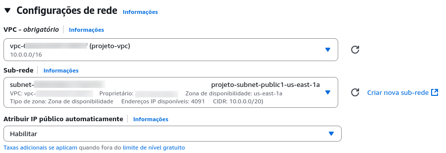

3.  **Configuração do Security Group:**

      * Foi criado um *Security Group* para a instância, permitindo:
          * **Acesso SSH (porta 22):** restrito apenas ao meu endereço de IP local para administração segura.
          * **Acesso HTTP (porta 80):** aberto para qualquer endereço IP, permitindo o acesso público à aplicação web.
      * 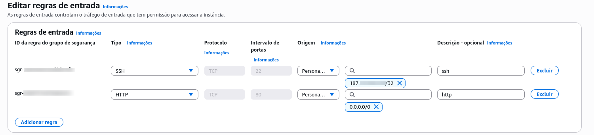
      * Foi acessado a instância EC2 via ssh utilizando o ip publico que foi gerado na instancia.

### Etapa 2: Configuração do Servidor Web

A instalação do Servidor Nginx foi automatizada utilizando um script bash seguindo as seguintes etapas:


#### 1. verificar\_root


A função inicial garante que o script seja executado com privilégios de superusuário (root), uma condição necessária para instalar pacotes e alterar configurações do sistema.

```bash
verificar_root() {
    # O id do root é sempre 0.
    if [[ "$(id -u)" -ne 0 ]]; then
        log_error "Este script precisa ser executado como root."
        exit 1
    fi
}
```

#### 2. detectar\_distro\_e\_configurar

Essa função lida com os dois possíveis casos de sistema operacional, baseados em Debian e em Fedora, permitindo que os pacotes posteriormente sejam instalados em ambos os sistemas. Ela identifica a distribuição, define o gerenciador de pacotes (`PKG_MANAGER`) e o diretório raiz do Nginx (`NGINX_ROOT_DIR`).

```bash
detectar_distro_e_configurar() {
    log_info "Detectando o sistema operacional e configurando variáveis..."
    if ! source /etc/os-release; then
        log_error "Não foi possível encontrar o arquivo /etc/os-release para detectar a distro."
        exit 1
    fi
    export PRETTY_NAME
    case "${ID_LIKE:-$ID}" in
        debian)
            log_info "Sistema da família Debian detectado."
            PKG_MANAGER="apt-get"
            NGINX_ROOT_DIR="/var/www/html"
        ;;
        rhel|fedora)
            log_info "Sistema da família Red Hat detectado."
            NGINX_ROOT_DIR="/usr/share/nginx/html"
            if command -v dnf &>/dev/null; then
                PKG_MANAGER="dnf"
            elif command -v yum &>/dev/null; then
                PKG_MANAGER="yum"
            else
                log_error "Nem 'dnf' nem 'yum' foram encontrados neste sistema RHEL-like."
                exit 1
            fi
        ;;
        *)
            log_error "Distribuição Linux não suportada: '${ID}'. Não é possível continuar."
            exit 1
        ;;
    esac
    log_success "Configurações para '${ID}' definidas."
}
```

#### 3. confirmar\_execucao

Para generalidade dos casos de uso, o script foi adaptado para funcionar tanto de uma forma interativa como não interativa. No caso da interativa, é verificado se o usuário quer confirmar as alterações antes de prosseguir.

```bash
confirmar_execucao() {
    if [[ ${AUTO_YES} -eq 1 ]]; then
        return 0
    fi

    log_info "Este script irá realizar as seguintes ações:"
    echo "  1. Instalar o pacote Nginx ('${NGINX_PACKAGE}')."
    echo "  2. Configurar o firewall (UFW ou firewalld) para permitir tráfego HTTP."
    echo "  3. Criar uma página de teste no diretório padrão do Nginx (${NGINX_ROOT_DIR})."
    echo "  4. Habilitar e iniciar o serviço Nginx."
    echo "  5. Configuração para reinicialização automática caso o serviço pare."

    read -p "Você deseja continuar? (s/N): " -r RESPOSTA
    if [[ ! "$RESPOSTA" =~ ^[sS]$ ]]; then
        log_info "Operação cancelada pelo usuário."
        exit 0
    fi
}
```

#### 4. instalar\_pacotes

Essa função se aproveita da variável `PKG_MANAGER`, atribuída na função anterior, para determinar qual gerenciador de pacotes será utilizado para instalar o Nginx e outras dependências como `git`, `curl` e `iproute2`.

```bash
instalar_pacotes() {

    log_info "Verificando se o Nginx já está instalado..."
    if ( [[ "$PKG_MANAGER" == "apt-get" ]] && dpkg -s "${NGINX_PACKAGE}" &>/dev/null ) || \
       ( [[ "$PKG_MANAGER" != "apt-get" ]] && rpm -q "${NGINX_PACKAGE}" &>/dev/null ); then
        log_info "O pacote '${NGINX_PACKAGE}' já está instalado."
        return 0
    fi

    log_info "Instalando o pacotes '${NGINX_PACKAGE}', git, curl e iproute2 com '${PKG_MANAGER}'..."
    if [[ "$PKG_MANAGER" == "apt-get" ]]; then
        apt-get update -qq
        apt-get install -y -qq "${NGINX_PACKAGE}" git curl iproute2
        log_success "Nginx, Git, Curl e iproute2 instalados com sucesso."
    else
        "$PKG_MANAGER" install -y "${NGINX_PACKAGE}" git
    fi
}
```

#### 5. configurar\_firewall

Novamente, para ser mais abrangente, a configuração do firewall foi feita para os casos de uso do `UFW` (Debian/Ubuntu) e `firewall-cmd` (Fedora/RHEL). Caso nenhum seja detectado, a etapa é pulada.

```bash
configurar_firewall() {
    log_info "Configurando o firewall..."
    if command -v ufw &>/dev/null; then
        log_info "Firewall UFW detectado."
        log_info "Verificando e permitindo tráfego na porta padrão do SSH (22/tcp)..."
        ufw allow 22/tcp
        if ! ufw status | grep -q "Status: active"; then
            log_info "Ativando o UFW..."
            ufw --force enable
        fi
        log_info "Permitindo tráfego 'Nginx HTTP' no UFW..."
        ufw allow "Nginx HTTP"
        log_success "UFW configurado."
        ufw status
    elif command -v firewall-cmd &>/dev/null; then
        log_info "Firewall firewalld detectado."
        if ! systemctl is-active --quiet firewalld; then
            log_info "Iniciando e habilitando o firewalld..."
            systemctl start firewalld
            systemctl enable firewalld
        fi
        log_info "Permitindo tráfego 'http' no firewalld..."
        firewall-cmd --add-service=http --permanent
        firewall-cmd --reload
        log_success "firewalld configurado."
        firewall-cmd --list-services
    else
        log_info "Nenhum firewall (UFW ou firewalld) encontrado. Pulando esta etapa."
    fi
}
```

#### 6. criar\_pagina\_teste

É criada uma estrutura HTML simples para a página que será exibida pelo Nginx. Caso já exista uma página `index.html`, um backup da versão original é criado.

```bash
criar_pagina_teste() {
    local NGINX_INDEX_FILE="${NGINX_ROOT_DIR}/index.html"

    if [[ -f "${NGINX_INDEX_FILE}" ]]; then
        local backup_file="${NGINX_INDEX_FILE}.bak.$(date +%F-%T)"
        log_info "Arquivo '${NGINX_INDEX_FILE}' existente. Criando backup em '${backup_file}'."
        mv "${NGINX_INDEX_FILE}" "${backup_file}"
    fi

    log_info "Criando arquivo de teste em '${NGINX_INDEX_FILE}'..."
    cat <<EOF > "${NGINX_INDEX_FILE}"
<!DOCTYPE html>
<html lang="pt-br">
<head>
    <meta charset="UTF-8">
    <title>Olá Mundo com Nginx</title>
</head>
<body>
    <h1>Instalação do Nginx bem-sucedida!</h1>
    <p>Esta página foi gerada automaticamente pelo script de instalação em um sistema <strong>${PRETTY_NAME:-Linux}</strong>.</p>
</body>
</html>
EOF
    log_success "Página de teste criada com sucesso."
}
```

#### 7. configurar\_restart

É criado um `override` para o `systemd`, configurando o serviço do Nginx para que seja reiniciado automaticamente 5 segundos após uma falha.

```bash
configurar_restart(){
    log_info "Configurando o serviço Nginx para reiniciar automaticamente"
    OVERRIDE_DIR="/etc/systemd/system/nginx.service.d"
    OVERRIDE_FILE="$OVERRIDE_DIR/override.conf"
    log_info "Criando o diretório de override: $OVERRIDE_DIR"
    mkdir -p "$OVERRIDE_DIR"
    cat <<EOF > "${OVERRIDE_FILE}"
[Service]
Restart=on-failure
RestartSec=5s
EOF

    log_info "Recarregando a configuração do systemd..."
    systemctl daemon-reload
    log_success "Configuração de reinício automático aplicada."
}
```

#### 8. instalar_monitor

Esta função orquestra a instalação opcional de um script de monitoramento. Ela clona um repositório Git, configura webhooks para notificações (Discord, Slack, Telegram) e instala o monitor como um serviço `systemd` (recomendado) ou como uma tarefa `cron`.

```bash
instalar_monitor() {
    if [[ ${INSTALL_MONITOR_FLAG} -eq 0 && ${AUTO_YES} -eq 0 ]]; then
        read -p "Deseja instalar o script de monitoramento via Git? (s/N): " -r RESPOSTA
        if [[ ! "$RESPOSTA" =~ ^[sS]$ ]]; then
            log_info "Instalação do monitor pulada."; return;
        fi
    elif [[ ${INSTALL_MONITOR_FLAG} -eq 0 ]]; then
        return 
    fi
    
    configurar_webhooks
    clonar_repositorio
    
    if [[ "${PKG_MANAGER}" != "apt-get" ]]; then
        log_info "Em sistemas da família Red Hat (não-Debian), o monitoramento é configurado exclusivamente com systemd."
        instalar_monitor_systemd
        return
    fi

    local ESCOLHA="1" 
    if [[ ${AUTO_YES} -eq 0 ]]; then
        read -p "Como deseja executar o monitor? [1] systemd (recomendado), [2] cron: " -r ESCOLHA
    fi

    case "${ESCOLHA}" in
        1) instalar_monitor_systemd;;
        2) instalar_monitor_cron;;
        *) log_warn "Opção inválida. Pulando configuração de inicialização automática.";;
    esac
}
```

#### 9. finalizar\_e\_verificar

Na etapa final, o script habilita o serviço Nginx para iniciar junto com o sistema, reinicia o serviço para aplicar todas as configurações e, por fim, verifica se ele está ativo. Em caso de sucesso, exibe o endereço de IP local para que o usuário possa acessar a página de teste no navegador.

```bash
finalizar_e_verificar() {
    log_info "Habilitando o serviço Nginx para iniciar com o sistema..."
    systemctl enable "${NGINX_PACKAGE}"

    log_info "Reiniciando o Nginx para aplicar as configurações..."
    systemctl restart "${NGINX_PACKAGE}"

    log_info "Verificando o status do serviço Nginx..."
    if ! systemctl is-active --quiet "${NGINX_PACKAGE}"; then
        log_error "O serviço Nginx falhou ao iniciar. Verifique o status detalhado abaixo:"
        systemctl status "${NGINX_PACKAGE}" --no-pager
        exit 1
    else
        log_success "O serviço Nginx está ativo e rodando."
    fi

    local ip_address
    ip_address=$(ip -4 addr show scope global | grep inet | awk '{print $2}' | cut -d'/' -f1 | head -n 1)
    log_success "Instalação concluída!"
    log_info "Acesse http://${ip_address} no seu navegador para testar."
}
```

### Etapa 3: Script de Monitoramento + Webhook

O script `service_status_check.sh` é uma ferramenta de monitoramento projetada para verificar a saúde de um serviço web (como Nginx, Apache, etc.) de forma generalizada. Ele realiza uma verificação em três níveis para garantir que o serviço não apenas esteja em execução, mas também respondendo corretamente a requisições.

O script é flexível, permitindo a verificação de diferentes serviços, portas e hosts, além de oferecer um modo de monitoramento contínuo e um sistema de notificações para alertar sobre falhas.

### Estrutura do Script e Funções

O funcionamento do script pode ser dividido nas seguintes etapas:

#### 1. Configuração Inicial e Variáveis

No início, são definidas variáveis padrão para o nome do serviço (`SERVICE_NAME`), porta (`PORT`), e outras configurações. O script também define variáveis para o sistema de notificações, que podem ser preenchidas através de um arquivo de configuração ou variáveis de ambiente.

```bash
### Valores Padrão
SERVICE_NAME="nginx"
PORT="80"
HOST="localhost"
LOG_FILE=""

CONTINUOUS_MODE=0
INTERVAL=60
CYCLE=0
HAD_ERROR=false

readonly MONITOR_CONFIG_DIR="/etc/service_monitor"
readonly MONITOR_CONFIG_FILE="${MONITOR_CONFIG_DIR}/config.env"

### Configuração de Notificações
DISCORD_WEBHOOK_URL="${DISCORD_WEBHOOK_URL:-}"
SLACK_WEBHOOK_URL="${SLACK_WEBHOOK_URL:-}"
TELEGRAM_BOT_TOKEN="${TELEGRAM_BOT_TOKEN:-}"
TELEGRAM_CHAT_ID="${TELEGRAM_CHAT_ID:-}"
```

#### 2. Verificação de Dependências

Antes de executar as verificações, o script garante que todas as dependências (`systemctl`, `ss`, `curl`, etc.) estão instaladas.

```bash
check_dependencies(){
    local dependencies=("systemctl" "ss" "curl" "date" "dirname" "mkdir" "touch")
        for dep in "${dependencies[@]}"; do
        if ! command -v "${dep}" &> /dev/null; then
            echo "A dependência '${dep}' não está instalada. Por favor, instale-a e tente novamente."
            exit 1
        fi
    done
}
```

#### 3. Sistema de Logs

Uma função `log` centralizada é usada para registrar todas as ações. Ela formata as mensagens com data e nível (INFO, SUCCESS, ERROR) e as exibe no console com cores, além de salvá-las em um arquivo de log (por padrão `/var/log/<service>_check.log`).

```bash
log() {
    local level="$1"
    local color="$2"
    local message="$3"
    
    local log_line="[$(date '+%Y-%m-%d %H:%M:%S')] [${level}] ${message}"
    local console_line="${color}${log_line}${COLOR_RESET}"

    echo -e "${console_line}"
    if [[ -n "${LOG_FILE}" ]]; then
        echo "${log_line}" >> "${LOG_FILE}"
    fi
}

log_info()    { log "INFO"    "${COLOR_BLUE}"   "$1"; }
log_success() { log "SUCCESS" "${COLOR_GREEN}"  "$1"; }
log_warn()    { log "WARN"    "${COLOR_YELLOW}" "$1"; }
log_error()   { log "ERROR"   "${COLOR_RED}"    "$1"; }
```

#### 4. Funções de Verificação

O monitoramento é feito por três funções principais:

##### 1. `check_systemd_status`

Verifica se o serviço está listado como "ativo" pelo `systemd`. Este é o primeiro nível de verificação, garantindo que o processo do serviço foi iniciado corretamente.

```bash
check_systemd_status() {
    log_info "Verificando o status do serviço '${SERVICE_NAME}' via systemd..."
    if ! systemctl is-active --quiet "${SERVICE_NAME}"; then
        die "O serviço '${SERVICE_NAME}' não está ativo."
    fi
    log_success "O serviço systemd está 'active (running)'."
}
```

##### 2. `check_port_listening`

Usa o comando `ss` para confirmar que há um processo escutando na porta TCP especificada. Isso garante que o serviço está escutando corretamente a determinada porta.

```bash
check_port_listening() {
    log_info "Verificando se a porta TCP/${PORT} está em modo LISTEN..."
    if ! ss -Hltn "sport = :${PORT}" | grep -q 'LISTEN'; then
        die "Nenhum processo está escutando na porta TCP/${PORT}."
    fi
    log_success "Um processo está escutando na porta ${PORT}."
}
```

##### 3. `check_http_response`

Utiliza o `curl` para fazer uma requisição HTTP ao serviço e verifica se o código de status retornado é funcional (2xx para sucesso ou 3xx para redirecionamento). Esta é a verificação final, que confirma que a aplicação está realmente funcional.

```bash
check_http_response() {
    log_info "Realizando uma requisição HTTP para http://${HOST}:${PORT}..."
    local http_code
    local curl_exit_code=0

    http_code=$(curl -o /dev/null -s -w "%{http_code}" --max-time 5 "http://${HOST}:${PORT}") || curl_exit_code=$?

    if [[ ${curl_exit_code} -ne 0 ]]; then
        die "Falha ao executar a requisição com cURL (código de saída: ${curl_exit_code})."
    fi

    if [[ "${http_code}" =~ ^(2..|3..)$ ]]; then
        log_success "O servidor respondeu com um código funcional: ${http_code}."
    else
        die "O servidor respondeu com um código de erro ou inesperado: ${http_code}."
    fi
}
```

#### 5. Tratamento de Erros e Notificações

Quando qualquer uma das verificações falha, a função `die` é chamada.

##### 1. `die`

Esta função registra o erro, envia uma notificação e, dependendo do modo de execução, encerra o script ou apenas retorna um código de erro para o ciclo contínuo.

```bash
die() {
    local error_message="$1"
    log_error "${error_message}"
    send_notification "${error_message}" "ERROR"

    if [[ "${CONTINUOUS_MODE}" = 1 ]]; then
        return 1
    else
        exit 1
    fi
}
```

##### 2. `send_notification`

Se as URLs de webhook (Discord, Slack) ou tokens de API (Telegram) estiverem configurados, esta função envia uma mensagem de alerta formatada, incluindo o nome do servidor, o serviço afetado e a mensagem de erro. Ela também envia uma notificação de **recuperação** quando um serviço que estava com falha volta a operar.

```bash
send_notification() {
    local message="$1"
    local type="${2:-ERROR}"
    local hostname=$(hostname)
    local full_message

    if [[ "${type}" == "RECOVERY" ]]; then
        full_message="✅ **Recuperação de Serviço**\n> **Servidor:** ${hostname}\n> **Serviço:** ${SERVICE_NAME}\n> **Info:** ${message}"
    else
        full_message="🚨 **Alerta de Monitoramento**\n> **Servidor:** ${hostname}\n> **Serviço:** ${SERVICE_NAME}\n> **Erro:** ${message}"
    fi

    # Envio para Discord, Slack e Telegram...
}
```

#### 6. Modo de Execução

A função `main` controla o fluxo de execução do script.

```bash
main() {
    #...
    if [[ "${CONTINUOUS_MODE}" = 1 ]]; then
        log_info "Modo contínuo ativado. Verificando a cada ${INTERVAL} segundos. Pressione [Ctrl+C] para parar."
        while true; do
            run_check_cycle
            log_info "Aguardando ${INTERVAL}s para o próximo ciclo..."
            sleep "${INTERVAL}"
        done
    else
        run_all_checks
        log_success "Verificação concluída. O serviço '${SERVICE_NAME}' está operando normalmente."
    fi
}
```

  - **Execução Única:** Se o modo contínuo não estiver ativo, ele simplesmente chama `run_all_checks` uma vez.
  - **Modo Contínuo (`-c`):** Se ativado, ele entra em um loop infinito, chamando `run_check_cycle` a cada `INTERVAL` segundos. A função `run_check_cycle` gerencia o estado de erro (`HAD_ERROR`) para decidir se uma notificação de recuperação deve ser enviada.


### Etapa 4: Automação e Testes

#### 1. Testes Realizados 

Foi criada uma instância EC2 para validar os scripts de instalação e monitoramento.


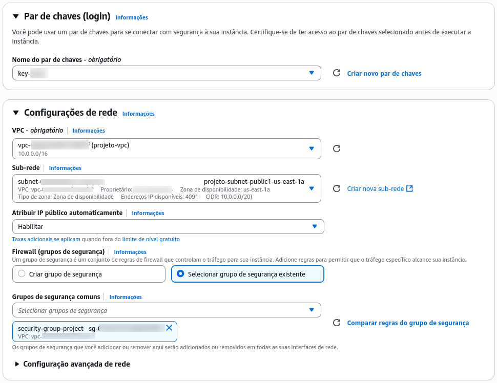

O campo **User Data** foi utilizado para automatizar a instalação do Nginx e do script de monitoramento na inicialização da instância.

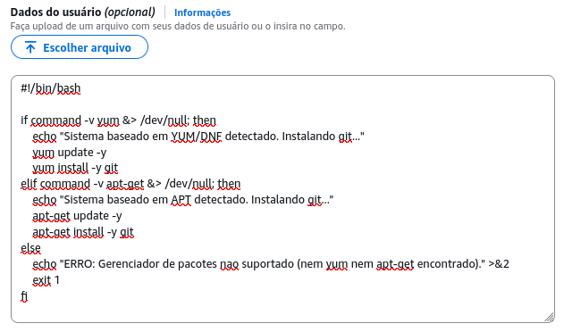
```bash 
#!/bin/bash

if command -v yum &> /dev/null; then
    echo "Sistema baseado em YUM/DNF detectado. Instalando git..."
    yum update -y
    yum install -y git
elif command -v apt-get &> /dev/null; then
    echo "Sistema baseado em APT detectado. Instalando git..."
    apt-get update -y
    apt-get install -y git
else
    echo "ERRO: Gerenciador de pacotes nao suportado (nem yum nem apt-get encontrado)." >&2
    exit 1
fi

CLONE_DIR="/opt/aws-web-infra-monitoring0"
REPO_URL="https://github.com/Nertonm/aws-web-infra-monitoring"
if [ -d "$CLONE_DIR" ]; then
    rm -rf "$CLONE_DIR"
fi
git clone "${REPO_URL}" "${CLONE_DIR}"

cd "${CLONE_DIR}"
chmod +x instalar_nginx.sh
./instalar_nginx.sh -y 
```

> *Por motivos de segurança, as chaves de API do webhook não foram exibidas, mas foram configuradas para Discord e Telegram.*
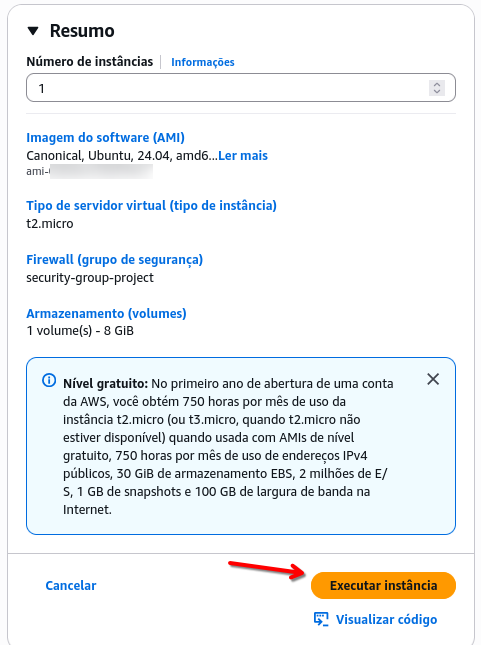

Após a instância ser executada e obter um IP público, a conexão foi estabelecida via SSH.

```bash
ssh -i "key-XXX.pem" ubuntu@eX-X-XX-X-X.compute-X.amazonaws.com
```

Após a conexão, foi verificado que o serviço Nginx estava funcionando corretamente e que o script de monitoramento também estava ativo.
O serviço está em execução (`active (running)`) e o `override` de reinicialização automática foi aplicado com sucesso.

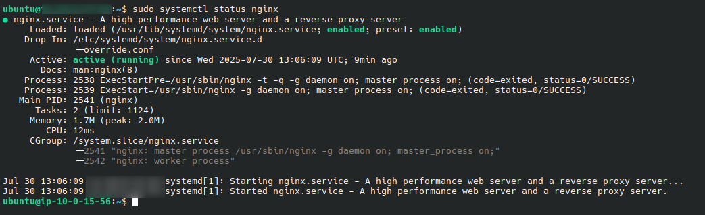

Acessando o IP público no navegador, a página de teste do Nginx foi exibida conforme esperado.
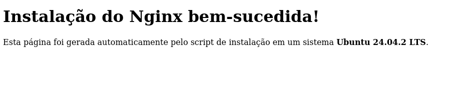

A análise do log `cloud-init-output.log` (em `/var/log/`) confirmou a saída do script executado via User Data.

```bash
Fetched 36.0 MB in 11s (3172 kB/s)
Reading package lists...
Reading package lists...
Building dependency tree...
Reading state information...
The following additional packages will be installed:
  git-man
Suggested packages:
  git-daemon-run | git-daemon-sysvinit git-doc git-email git-gui gitk gitweb
  git-cvs git-mediawiki git-svn
The following packages will be upgraded:
  git git-man
2 upgraded, 0 newly installed, 0 to remove and 96 not upgraded.
Need to get 4780 kB of archives.
After this operation, 1024 B disk space will be freed.
Get:1 http://XXXXXX.archive.ubuntu.com/ubuntu noble-updates/main amd64 git-man all 1:2.43.0-1ubuntu7.3 [1100 kB]
Get:2 http://XXXXX.archive.ubuntu.com/ubuntu noble-updates/main amd64 git amd64 1:2.43.0-1ubuntu7.3 [3680 kB]
dpkg-preconfigure: unable to re-open stdin: No such file or directory
Fetched 4780 kB in 0s (20.0 MB/s)
(Reading database ... 70681 files and directories currently installed.)
Preparing to unpack .../git-man_1%3a2.43.0-1ubuntu7.3_all.deb ...
Unpacking git-man (1:2.43.0-1ubuntu7.3) over (1:2.43.0-1ubuntu7.2) ...
Preparing to unpack .../git_1%3a2.43.0-1ubuntu7.3_amd64.deb ...
Unpacking git (1:2.43.0-1ubuntu7.3) over (1:2.43.0-1ubuntu7.2) ...
Setting up git-man (1:2.43.0-1ubuntu7.3) ...
Setting up git (1:2.43.0-1ubuntu7.3) ...
Processing triggers for man-db (2.12.0-4build2) ...

Running kernel seems to be up-to-date.

No services need to be restarted.

No containers need to be restarted.

No user sessions are running outdated binaries.

No VM guests are running outdated hypervisor (qemu) binaries on this host.
Cloning into '/opt/aws-web-infra-monitoring0'...
[INFO] Detectando o sistema operacional e configurando variáveis...
[INFO] Sistema da família Debian detectado.
[SUCESSO] Configurações para 'ubuntu' definidas.
[INFO] Verificando se o Nginx já está instalado...
[INFO] Instalando o pacotes 'nginx', git, curl e iproute2 com 'apt-get'...
dpkg-preconfigure: unable to re-open stdin: No such file or directory
(Reading database ... 70681 files and directories currently installed.)
Preparing to unpack .../iproute2_6.1.0-1ubuntu6.2_amd64.deb ...
Unpacking iproute2 (6.1.0-1ubuntu6.2) over (6.1.0-1ubuntu6) ...
Selecting previously unselected package nginx-common.
Preparing to unpack .../nginx-common_1.24.0-2ubuntu7.4_all.deb ...
Unpacking nginx-common (1.24.0-2ubuntu7.4) ...
Selecting previously unselected package nginx.
Preparing to unpack .../nginx_1.24.0-2ubuntu7.4_amd64.deb ...
Unpacking nginx (1.24.0-2ubuntu7.4) ...
Setting up iproute2 (6.1.0-1ubuntu6.2) ...
Setting up nginx-common (1.24.0-2ubuntu7.4) ...
Created symlink /etc/systemd/system/multi-user.target.wants/nginx.service → /usr/lib/systemd/system/nginx.service.
Setting up nginx (1.24.0-2ubuntu7.4) ...
 * Upgrading binary nginx                                                [ OK ] 
Processing triggers for man-db (2.12.0-4build2) ...
Processing triggers for ufw (0.36.2-6) ...

Running kernel seems to be up-to-date.

No services need to be restarted.

No containers need to be restarted.

No user sessions are running outdated binaries.

No VM guests are running outdated hypervisor (qemu) binaries on this host.
[SUCESSO] Nginx, Git, Curl e iproute2 instalados com sucesso.
[INFO] Configurando o firewall...
[INFO] Firewall UFW detectado.
[INFO] Verificando e permitindo tráfego na porta padrão do SSH (22/tcp)...
Rules updated
Rules updated (v6)
[INFO] Ativando o UFW...
Firewall is active and enabled on system startup
[INFO] Permitindo tráfego 'Nginx HTTP' no UFW...
Rule added
Rule added (v6)
[SUCESSO] UFW configurado.
Status: active

To                         Action      From
--                         ------      ----
22/tcp                     ALLOW       Anywhere                  
Nginx HTTP                 ALLOW       Anywhere                  
22/tcp (v6)                ALLOW       Anywhere (v6)             
Nginx HTTP (v6)            ALLOW       Anywhere (v6)             

[INFO] Criando arquivo de teste em '/var/www/html/index.html'...
[SUCESSO] Página de teste criada com sucesso.
[INFO] Configurando o serviço Nginx para reiniciar automaticamente
[INFO] Criando o diretório de override: /etc/systemd/system/nginx.service.d
[INFO] Recarregando a configuração do systemd...
[SUCESSO] Configuração de reinício automático aplicada.
[INFO] Configurando credenciais de notificação...
[INFO]   -> Usando URL do Discord fornecida por parâmetro.
[INFO]   -> Usando Token do Telegram fornecido por parâmetro.
[INFO]   -> Usando Chat ID do Telegram fornecido por parâmetro.
[SUCESSO] Credenciais salvas em XXXXXXXXXX
[INFO] Clonando repositório de https://github.com/Nertonm/aws-web-infra-monitoring...
Cloning into '/opt/aws-web-infra-monitoring'...
[INFO] Instalando 'service_status_check.sh' em '/usr/local/bin/service_status_check.sh'...
[SUCESSO] Script de monitoramento instalado com sucesso.
[INFO] Configurando o monitor como um serviço systemd...
Created symlink /etc/systemd/system/multi-user.target.wants/monitor-nginx.service → /etc/systemd/system/monitor-nginx.service.
[SUCESSO] Serviço de monitoramento 'monitor-nginx.service' habilitado e iniciado.
[INFO] Use 'systemctl status monitor-nginx.service' para ver o status.
[INFO] Habilitando o serviço Nginx para iniciar com o sistema...
Synchronizing state of nginx.service with SysV service script with /usr/lib/systemd/systemd-sysv-install.
Executing: /usr/lib/systemd/systemd-sysv-install enable nginx
[INFO] Reiniciando o Nginx para aplicar as configurações...
[INFO] Verificando o status do serviço Nginx...
[SUCESSO] O serviço Nginx está ativo e rodando.
[SUCESSO] Instalação concluída!
[INFO] Acesse http://XXXXX no seu navegador para testar.
Cloud-init v. XXXX-0ubuntu0~XXXXX finished at Wed, 30 Jul 2025 13:06:09 +0000. Datasource DataSourceEc2Local.  Up 63.83 seconds
```
Analisando o log, percebe-se que o script de instalação automatizada funcionou perfeitamente: instalou as dependências, configurou o firewall para permitir tráfego SSH e HTTP, clonou o repositório e configurou o monitoramento para rodar continuamente via `systemd`.

Para testar o script de monitoramento, o serviço Nginx foi interrompido propositalmente com o comando:

```bash
sudo systemctl stop nginx
```

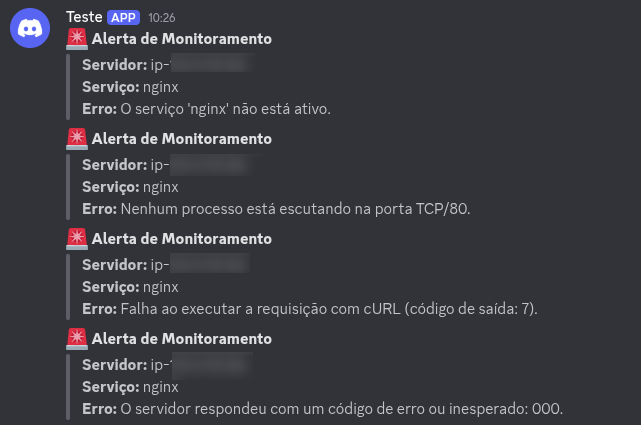
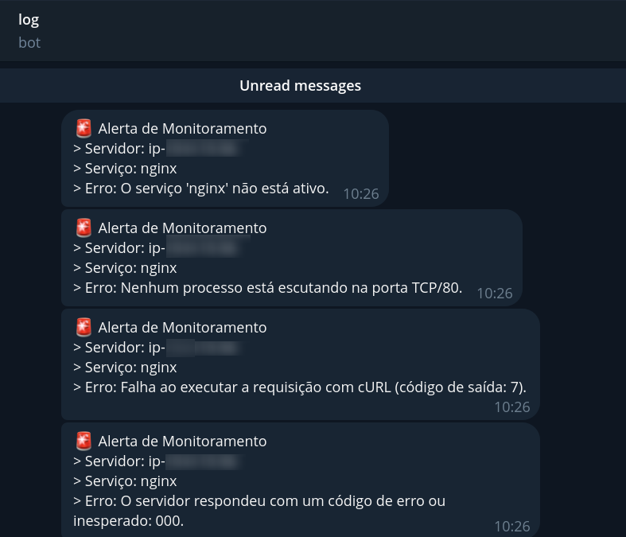
Foram recebidas notificações de erro no Discord e Telegram, informando que o serviço havia parado, que a porta não estava mais escutando e que o servidor não respondia a requisições HTTP.


**Reiniciando o serviço**
```bash
sudo systemctl start nginx
```
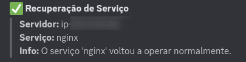


Logo após, notificações de **recuperação** foram enviadas, confirmando que o serviço havia voltado a operar normalmente.

Os logs detalhados do monitoramento também puderam ser consultados no arquivo `/var/log/nginx_check.log`.
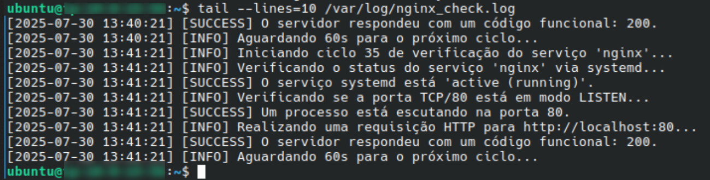
